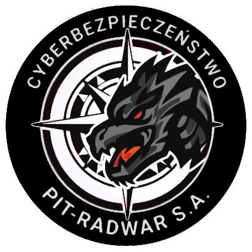

<b><a href="https://baycode.eu">Visit _baycode.eu</a></b>

 

-brightgreen.svg)

-brightgreen.svg)
-brightgreen.svg)

 

<a href="https://news.baycode.eu">Visit my blog</a>

<a href="https://baycode.eu/pentest">Preview demo pentest report</a>

 
 
 
 
 

