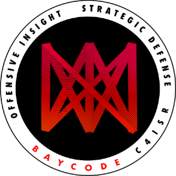

## 🔗 **Useful Links**

- **🌐 [Visit baycode.eu](https://baycode.eu)**
- **📝 [Visit My Blog](https://news.baycode.eu)**
- **📄 [Preview Demo Pentest Report](https://baycode.eu/pentest)**

---

  
  
  
  

## 🌐 Cyber Services
      

   

    

 
 

## 🚀 SWE Stack

       
   

       

      

      

       

 

      

    

      

   

    

---

      

---

                

      

---

              
                        

---

      

        

---

          

